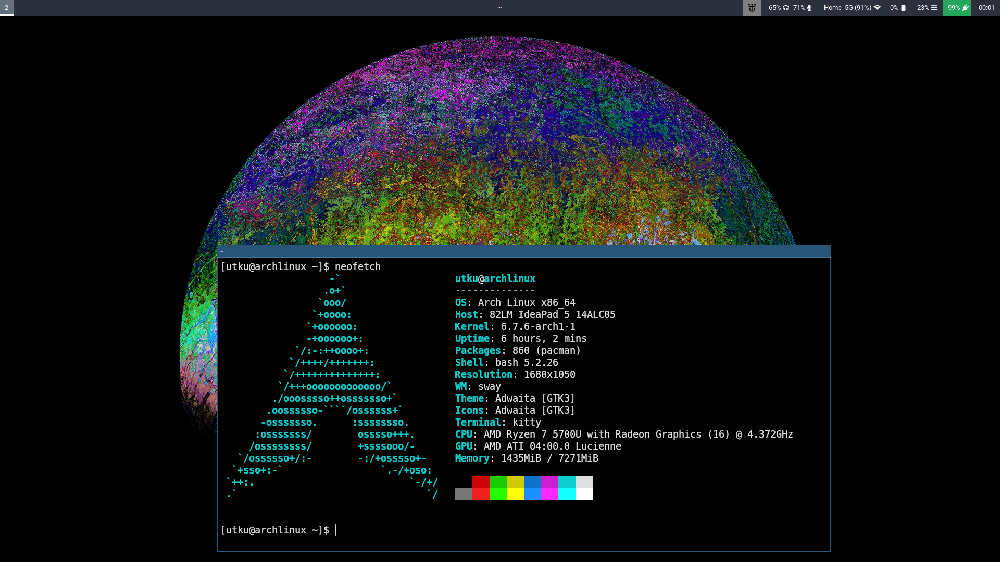

# WM CONFIGS


<br>
[HYPRLAND CONFIG](hyprland-dotfiles/README.md)<br><br>
Currently no image for i3 <br>
[i3WM CONFIG](i3wm-dotfiles/README.md)
<br><br>

[SWAY CONFIG](sway-dotfiles/README.md)

## Removing Beeping Sound of Archlinux

### Step 1: Change Directory to Specified Directory

```shell
cd /etc/modprobe.d/
```

### Step 2: Create a `.conf` file

```shell
sudo touch nomorebeeps.conf
```

### Step 3: Add the Following Line to the Config

Note that changes will be effective after rebooting the system.

```shell
blacklist pcspkr
```
