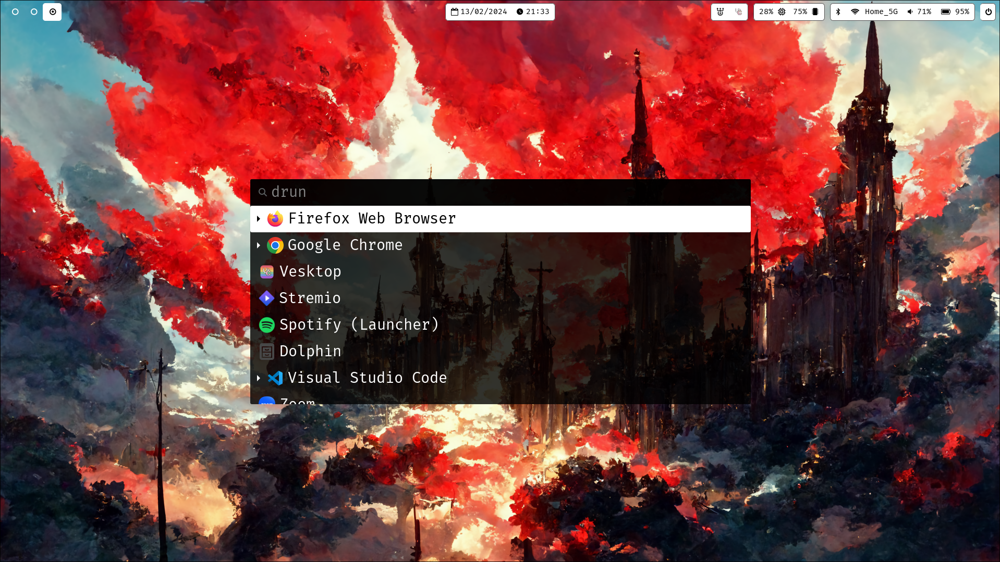
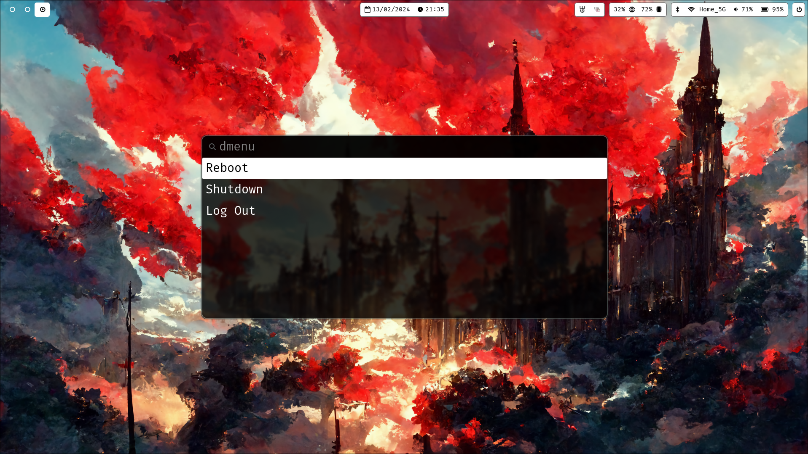

# Hyprland Config

## Packages used

- Notifications: [dunst](https://github.com/dunst-project/dunst)
- VM: [hyprland](https://github.com/hyprwm/Hyprland)
- Bar: [waybar](https://github.com/Alexays/Waybar)
- App Launcher: [wofi](https://hg.sr.ht/~scoopta/wofi)
- Lockscreen: [swaylock-effects](https://github.com/mortie/swaylock-effects)
- Screenshot: [grim](https://sr.ht/~emersion/grim/) and [slurp](https://github.com/emersion/slurp)

## Fonts used

- [FiraCode Nerd Font](https://github.com/ryanoasis/nerd-fonts/releases/download/v3.1.1/FiraCode.zip)

## Note

Save new wallpapers to the `.config/wallpapers` directory with numerical order (e.g. `1.png`, `2.png` and so on) to make random wallpaper selection stuff work.
